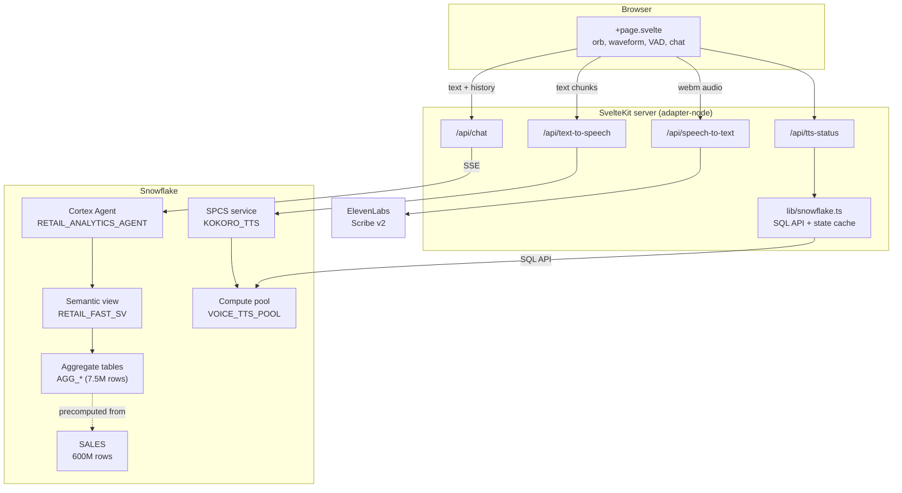

# Architecture

A voice interface to a Snowflake Cortex Agent. You speak a question, it queries
600M+ retail records, and it answers out loud.

Everything except speech-to-text runs inside Snowflake.

---

## 1. System overview



**The request path is three independent round trips**, not one pipeline. The
browser orchestrates them, so a failure in any one degrades rather than breaks
the demo.

---

## 2. Components

| Path | Lines | Role |
|---|---|---|
| `src/routes/+page.svelte` | 1222 | Entire UI: orb, waveform, VAD, hands-free, SSE parsing, chart rendering, playback queue |
| `src/app.css` | 762 | Dark theme, orb animation, layout |
| `src/lib/snowflake.ts` | 181 | SQL API client, ingress URL + service-state caching, pool lifecycle |
| `src/routes/api/text-to-speech/+server.ts` | 84 | Proxy to Kokoro on SPCS, with fallback signalling |
| `src/routes/api/chat/+server.ts` | 57 | Cortex Agent SSE proxy |
| `src/lib/config.ts` | 49 | Env vars (deployed) → `config.json` (local) |
| `src/routes/api/speech-to-text/+server.ts` | 34 | ElevenLabs Scribe v2 |
| `src/routes/api/tts-status/+server.ts` | 34 | State reporting + resume/suspend |

Deployment is Snowflake App Runtime (`app.yml`): `npm ci` → `npm run build` →
`node build/index.js` on port 8080.

---

## 3. Data flow

### 3.1 Speech in

`MediaRecorder` captures `audio/webm`, posted as `FormData` to
`/api/speech-to-text`, which forwards to ElevenLabs Scribe v2 and returns text.
The transcript is then sent through the normal chat path — voice and typed input
converge immediately, so there is only one query path to reason about.

**This is the only component not inside Snowflake.** It is on the ElevenLabs free
tier, which includes STT but *not* TTS (see §5.1).

### 3.2 Query

`/api/chat` posts to the Cortex Agent `:run` endpoint with
`Accept: text/event-stream` and streams raw bytes straight back to the browser
via a `ReadableStream`. The server does not parse the SSE — the browser does.

The client accumulates multi-line `data:` payloads and dispatches on empty-line
event boundaries. Two deduplication rules matter, because the agent re-emits
content as it refines:

- **Charts and tables:** deduplicated by `tool_use_id`.
- **Text:** take the last non-empty item rather than concatenating.

Without these you get duplicated charts and doubled prose.

### 3.3 Speech out

Auto-speaks on every completed response. Text is cleaned of markdown, split into
sentence groups, and played as a queue (see §4.1).

---

## 4. Design decisions worth knowing

### 4.1 Chunked TTS playback, not streaming

**Time-to-first-audio was ~5.5s. It is now ~1.3s.** Three causes, in order of
impact:

1. **`getTtsState()` ran two SQL round-trips per utterance** (`SHOW COMPUTE
   POOLS` + `DESCRIBE SERVICE`, ~2.5s each) before it could even request audio.
   A `READY` verdict is now cached for 60s. Non-ready states are *not* cached, so
   a service coming back is picked up immediately.

2. **One request covered the whole response**, so synthesis time scaled with the
   full answer length. Text is now split into sentence groups — first group ≤90
   chars so it generates fast, later groups ≤260 for natural prosody — and each
   group is fetched while the previous one plays. A `speakToken` counter cancels
   a superseded queue.

3. **Streaming pass-through does not work, so chunking was the only option.**
   Kokoro itself streams correctly (1.2s to first byte, measured directly). But
   both Vite dev *and* the production `adapter-node` build buffer the upstream
   body before flushing — measured, not assumed. A `GET` handler exists for
   `<audio src>` progressive playback and did not help; it is retained but is not
   the mechanism that fixed this.

### 4.2 Voice activity detection

Two independent detectors, both reading RMS from `getByteTimeDomainData`:

- **Auto-stop** ends a turn after 1300ms of silence, reusing the analyser already
  attached for the waveform.
- **Hands-free** holds the mic open and starts recording on 180ms of sustained
  speech.

**Hands-free owns a separate `AudioContext` and analyser but shares the
`MediaStream`.** Separate context because starting a recording tears down the
waveform context, which would kill the listener. Shared stream so mic permission
is requested exactly once.

Three constraints that are easy to get wrong:

- **Never learn the noise floor from speech.** Learning it unconditionally at
  startup lets the user's own voice become the "ambient" baseline, pushing the
  threshold above speaking level — and a `level < floor * 1.5` update gate makes
  that state unrecoverable. The floor is only learned from frames below the
  current threshold, falls fast, and rises slowly. Speech RMS is ~0.06–0.12; the
  threshold ceiling is 0.07.
- **Suppress detection while the agent speaks**, or it hears its own TTS through
  the speakers and holds the mic open forever. Plus a 700ms cooldown after each
  turn so the tail of an utterance cannot retrigger.
- **`AudioContext` created after an `await` may be suspended.** The await breaks
  the user-gesture chain and Chrome can return a suspended context that reports
  only silence. Resume explicitly.

A live input meter with the threshold marked is rendered in the UI, because mic
gain problems and threshold problems look identical from the outside.

### 4.3 Query performance: pre-aggregation

The agent originally queried `SALES` (600M rows, ~15 GB scans) and hit its
response budget. `RETAIL_FAST_SV` reads five aggregate tables instead:

| Table | Rows |
|---|---|
| `AGG_PRODUCT_MONTHLY` | 7.5M (157 MB) |
| `AGG_DEALER_MONTHLY` | 50K |
| `AGG_CUSTOMER_MONTHLY` | 50K |
| `AGG_TOP_PRODUCTS` | 5K |
| `AGG_TOP_DEALERS` | 5K |

Grain selection is cardinality-driven and took iteration: `PRODUCT_ID` and
`DEALER_ID` together barely reduced row count, and even `SIZE_CLASS` (50 values)
left 296M rows. Dropping it reached 7.5M. Totals reconcile exactly against source
— $21,796.302B revenue, 600,037,902 lines.

Semantic view constraints hit along the way: aliases after `AS` must match the
source column name exactly; numeric columns must be `FACTS`, not `DIMENSIONS`;
and metrics must be aggregated when selected through `SEMANTIC_VIEW()`.

### 4.4 Self-hosted TTS on SPCS

Kokoro-82M via Kokoro-FastAPI, exposing an OpenAI-compatible
`/v1/audio/speech` on port 8880 with a readiness probe on `/health`.

**This is more expensive than the alternatives and that is a deliberate
trade-off.** SPCS is ~1.1 credits/hr versus ElevenLabs at ~$0.22/hr or Azure free
tier. It is justified by data locality and the all-in-Snowflake story, not
economics. It exists because the ElevenLabs free tier blocks TTS entirely (§5.1)
and Azure signup rejected a work email.

Lifecycle is explicit (`npm run tts:up` / `tts:down`) plus in-app controls,
because idle cost is real.

---

## 5. Constraints and failure modes

### 5.1 ElevenLabs free tier has STT but not TTS

TTS returns HTTP 402 `paid_plan_required` — "Free users cannot use library voices
via the API", and `/v1/voices` returns empty. This is why TTS is self-hosted while
STT is not.

### 5.2 TTS degradation chain

`Kokoro on SPCS` → `browser speechSynthesis` → silent text-only.

`/api/text-to-speech` returns `503` with `{ fallback: true, state, detail }`
rather than a generic error, so the client can distinguish "use browser speech"
from a real failure. The engine badge reflects which is active.

The client re-checks state before speaking and polls every 30s, because the
service can be suspended out-of-band by `tts:down` or auto-suspend.

### 5.3 SPCS gotchas

- **`AUTO_SUSPEND_SECS` measures "no services and no jobs"** — a running service
  blocks it indefinitely. The pool will *not* auto-suspend just because nobody is
  talking. This is the main cost risk.
- **Suspending a pool suspends its services, but resuming the pool does not
  resume them.** Both `ALTER COMPUTE POOL ... RESUME` and `ALTER SERVICE ...
  RESUME` are required; `resumeTts()` does both.
- **ACCOUNTADMIN can create pools and grant `BIND SERVICE ENDPOINT` but cannot
  own a service.** Hence `VOICE_TTS_ROLE` owns `KOKORO_TTS`.
- **A role-restricted PAT cannot assume a different role via the SQL API.**
  `VOICE_TTS_ROLE` is granted to `SYSADMIN` so the PAT's role inherits pool and
  service privileges; `ROLE` in `snowflake.ts` is therefore `undefined`.
- **Cold start is minutes**, not seconds: node provisioning → image pull (4.95 GB)
  → model load. Treat anything other than `READY` as "fall back", not "wait".
- **Ingress endpoints time out after 90s.**

### 5.4 Auth

Two different header formats against the same account:

- SQL API and Cortex Agent: `Authorization: Bearer <PAT>`
- SPCS ingress: `Authorization: Snowflake Token="<PAT>"`

### 5.5 Layout constraint

`.conversation-pane` is a grid item, and grid items default to
`min-height: auto`. Without an explicit `min-height: 0`, it stretches to fit its
content instead of being capped at the `100vh` row, and `.chat-area` never becomes
a scroll container at all — `scrollHeight === clientHeight`, so setting
`scrollTop` is a silent no-op. Both the pane and the chat area need
`min-height: 0`.

---

## 6. Cost

| Component | Rate | Notes |
|---|---|---|
| SPCS `CPU_X64_M` pool | ~1.1 credits/hr | Only while up; does **not** auto-suspend with a live service |
| `DEMO_STANDARD_WH` (Medium) | 4 credits/hr | Only during queries |
| ElevenLabs Scribe v2 | Free tier | STT only |

Total SPCS spend during development was 0.0358 credits. Run `npm run tts:down`
when not demoing.

---

## 7. Configuration

`src/lib/config.ts` reads environment variables first, then falls back to
`config.json`. Deployed via SAR the env vars are set; locally `config.json`
(gitignored) holds them.

Required: `SNOWFLAKE_ACCOUNT`, `SNOWFLAKE_TOKEN` (PAT), `ELEVENLABS_API_KEY`.
Optional with defaults: `SNOWFLAKE_DATABASE` (`INTERACTIVE_DEMO`),
`SNOWFLAKE_SCHEMA` (`RETAIL`), `SNOWFLAKE_AGENT` (`RETAIL_ANALYTICS_AGENT`).

---

## 8. Operations

```bash
npm run dev          # local dev server

npm run tts:setup    # one-time: db, schema, image repo, role, compute pool
npm run tts:image    # build + push Kokoro image (requires Docker)
npm run tts:create   # one-time: create the service

npm run tts:up       # resume pool AND service
npm run tts:down     # suspend — do this when not demoing
npm run tts:status   # pool state + service status
```

The app works without any of the `tts:*` steps — it falls back to browser speech.
